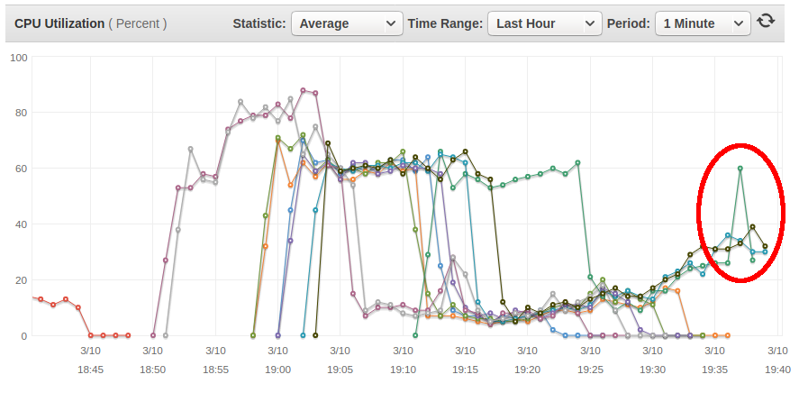

<!-- Main -->

<!-- One -->
<section id="one">
	

		<header class="major">
			<h2>Summon servers to meet demand</h2>
		</header>
		
Many websites will use one big server for everything.  Why pay for something that's only going to be fully utilized during peak hours?  With our model, we spin up several small servers when traffic increases, then shut them down when things settle.  Not only is this cost effictive, it's safer.  One server out of 10 crashing is much less worrying than your only server crashing.

	

</section>

<!-- Two -->
<section id="two" class="spotlights">
	

		<header class="major">
			<h3>Lets look at a real example</h3>
		</header>
		
		
Here we see in increase in CPU usage on the two running web servers.

		
		
Before the servers max out at 100%, additional servers are brought online to handle demand.

		
		
Traffic normalizes as we find a comfortable amount of computing power to handle the burst in traffic.

		
		
The traffic surge is over, terminate the idle servers.

		
		
Return to normal operation, around 30% CPU usage.

	

</section>

<!-- Three -->
<section id="three">
    

        
All of this occured in less than one hour.  The site went from two servers, to 10 servers, back down to three servers.  All without human interaction or interupted service.

        
The client was billed for <em>minutes</em> of server usage, not hours, days or months.

    

</section>

